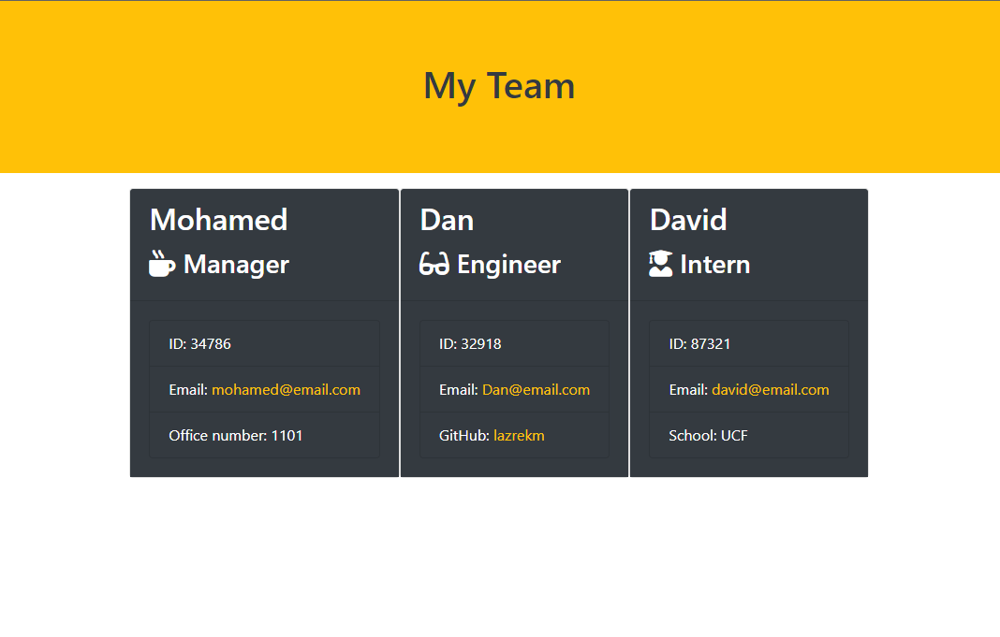

# se-team-generator
  

  ## Description

  A command line application that generates a software engineering team, it takes in informations about employees and generates an HTML webpage that displays a profile for each person.
  
  ## Table of Contents 
  
  * [Installation](#installation)
  
  * [Usage](#usage)
  
 * [License](#license)

  
  * [Tests](#tests)
  
  * [Questions](#questions)
  
  ## Installation
  To install dependencies, run the following:

  `
  npm i
  `
  
  ## Usage

  

  
 
  ## License
  

    This repository is licensed under the MIT license 
  
  ## Tests
  To run tests, run the following:
  `
  npm test
  `
  ## Questions
  Questions about this repository? Please contact me at [mohamed.lazrekb@gmail.com](mailto:mohamed.lazrekb@gmail.com). View more of my work in GitHub at [Lazrekm](https://github.com/lazrekm) 
  